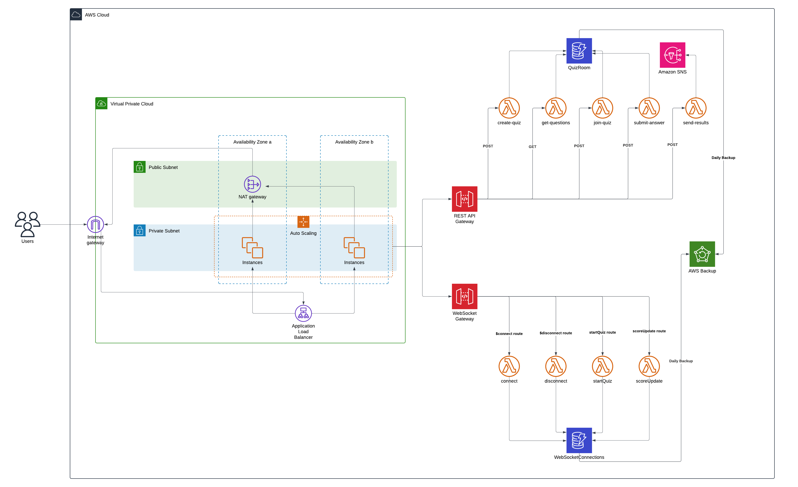

# Quizzy Application

Quizzy is a **real-time, interactive quiz platform** designed to support thousands of concurrent users. This cloud-native application leverages modern cloud services to ensure scalability, high availability, and low latency.

## Architecture Overview

The application is built using **AWS Cloud Architecture** with a focus on resilience, scalability, and security. Below is an overview of the architecture:

### Key Components
1. **Virtual Private Cloud (VPC)**:
   - **Public Subnets**: For internet-facing components like the **Application Load Balancer (ALB)** and **NAT Gateway**.
   - **Private Subnets**: For secure deployment of **Auto-Scaling EC2 instances** hosting the application logic.
   - **Multi-AZ Deployment**: Ensures high availability by spreading resources across multiple availability zones.

2. **Application Load Balancer (ALB)**:
   - Distributes incoming traffic to EC2 instances in private subnets.
   - Ensures fault tolerance and scalability.

3. **AWS Lambda**:
   - Implements serverless functions for various quiz functionalities like `create-quiz`, `get-questions`, `join-quiz`, `submit-answer`, and `send-results`.

4. **API Gateway**:
   - **REST API Gateway**: Manages API endpoints for client-server communication.
   - **WebSocket Gateway**: Enables real-time communication for quiz sessions.

5. **AWS DynamoDB**:
   - NoSQL database to store quiz data with high performance and scalability.

6. **Amazon Simple Notification Service (SNS)**:
   - Used for sending notifications or updates to users.

7. **AWS Backup**:
   - Automates daily backups of DynamoDB to ensure data durability and recovery.

8. **NAT Gateway**:
   - Allows private subnet instances to access the internet securely.

## Features

- **Real-time Quiz Interaction**:
  - WebSocket-based communication for instant updates.
  - Supports 2,000+ concurrent users with sub-100ms latency.

- **Scalability and Fault Tolerance**:
  - Auto-scaling EC2 instances ensure seamless performance during traffic spikes.
  - Multi-AZ deployment ensures application uptime even during failures.

- **Secure Cloud Design**:
  - Resources are deployed in private subnets for enhanced security.
  - IAM policies and security groups restrict access to resources.

- **Data Backup**:
  - Daily backups of quiz data in DynamoDB using AWS Backup.

## Technologies Used

### Backend:
- **AWS Services**: Lambda, API Gateway, DynamoDB, EC2, VPC, SNS, S3, CloudFormation.
- **WebSocket**: For real-time communication.

### Frontend:
- **React**: Client-side application to interact with APIs and render quizzes.

### DevOps:
- **Jenkins**: For CI/CD pipelines.
- **Docker**: Containerized deployment.
- **Terraform**: Infrastructure as Code.

### Programming Languages:
- **Java**, **Python**, **JavaScript**.

## Prerequisites

To run the application, ensure you have the following:
- AWS account with necessary IAM permissions.
- Jenkins for CI/CD pipeline.
- Docker installed locally.

## Setup and Deployment

1. **Clone the Repository**:
   ```bash
   git clone https://github.com/your-repo/quizzy.git
   cd quizzy
   ```

2. **Infrastructure Deployment**:
   - Use the provided CloudFormation templates to deploy the AWS architecture.
   - Alternatively, use Terraform for Infrastructure as Code.

3. **Backend Setup**:
   - Deploy AWS Lambda functions for quiz operations.
   - Configure API Gateway and WebSocket Gateway.

4. **Frontend Setup**:
   - Build the React application.
   - Deploy the application to an S3 bucket or host on EC2 instances.

5. **CI/CD Pipeline**:
   - Configure Jenkins pipelines for automated builds and deployments.

## Usage

1. Access the application through the provided **Application Load Balancer URL**.
2. Create or join a quiz session in real-time.
3. Monitor quiz results and notifications.

## Diagram



## Contributing

Contributions are welcome! Feel free to raise issues or submit pull requests to improve the application.

## License

This project is licensed under the MIT License. See the `LICENSE` file for details.
